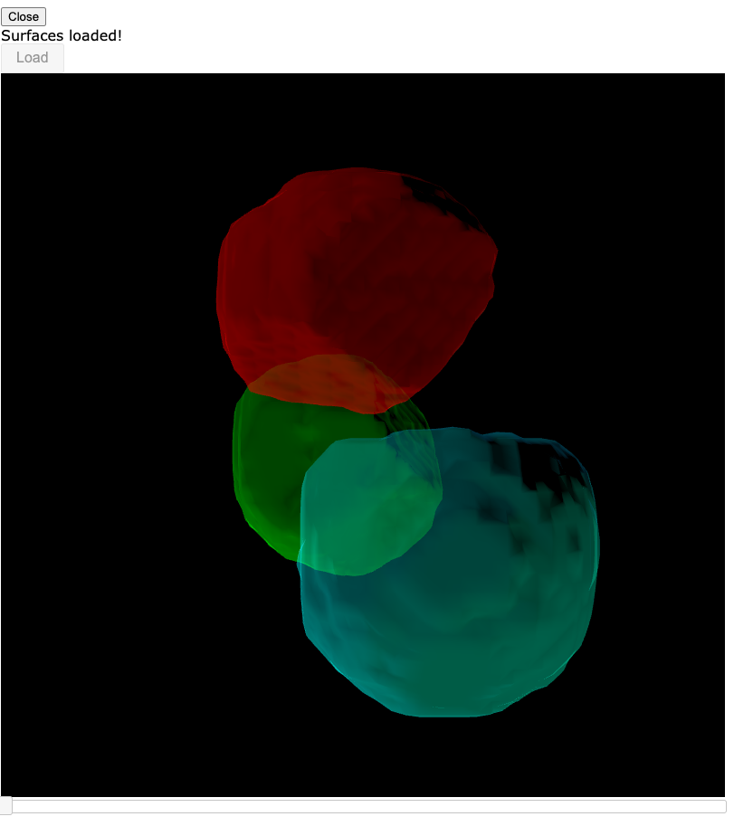

# segmentation_viz_workflow

Code and documentation about creating microscopy cell segmentation visualizations.

This package requires python 3.

```
$ python --version
Python 3.6.13 :: Anaconda, Inc.
```

# Installation

The install procedure is not fully automated.

Please install the following dependencies manually in the following order.

```
 pip install git+https://github.com/AaronWatters/H5Gizmos
 pip install git+https://github.com/AaronWatters/jp_doodle
 pip install git+https://github.com/AaronWatters/feedWebGL2
 pip install git+https://github.com/flatironinstitute/mouse_embryo_labeller
```

Then clone this repository and in the top level folder of the repository install the module in development mode as follows:

```bash
 pip install -e .
```

# Running the examples

The `examples` folder contains an example CSV file with a truncated set of label arrays in a subfolder.

```
examples/segmentation/00008_rescaled_low_cp_masks.tif
examples/segmentation/00000_rescaled_low_cp_masks.tif
examples/segmentation/00007_rescaled_low_cp_masks.tif
examples/segmentation/00002_rescaled_low_cp_masks.tif
examples/segmentation/00005_rescaled_low_cp_masks.tif
examples/segmentation/00004_rescaled_low_cp_masks.tif
examples/segmentation/00003_rescaled_low_cp_masks.tif
examples/segmentation/00006_rescaled_low_cp_masks.tif
examples/segmentation/00001_rescaled_low_cp_masks.tif
examples/segmentation/00009_rescaled_low_cp_masks.tif
examples/stack_2_tree_cell_association.csv
```

## Capturing the surfaces as JSON

The `examples/capture_surfaces.py` shows example code for capturing surface data for cell lineage 1 using the CSV and the arrays.
The script uses a browser interface to extract the geometries.

```bash
% cd examples
% python capture_surfaces.py
```

The processor uses WebGL in a browser to capture the surfaces.
Open the link printed by the script in a browser to establish
the browser connection and start the capture process.

**Important**: The browser tab for capturing the surfaces does not exit automatically.
Close the tab manually once the script completes.

After a successful run the capture script generates the surface data in `examples/surfaces.json`.

## Viewing the surfaces

After the capture process is complete view the surfaces using the `view_surfaces.py` script:
```bash
% python view_surfaces.py
```

Open the link printed by the script in a browser tab to view the surfaces.

Press the load button to load the JSON data (this step is provided for easy javascript debugging).
The viewer should look something like this:


Please use the source code and examples to generate surfaces for other data sets.

# Viewing multiple lineages

The scripts `examples/capture_lineages.py` and `examples/view_lineages.py` illustrate how to
process and view multiple lineages using specified colors for each lineage.  Please look to
the scripts for more information.

